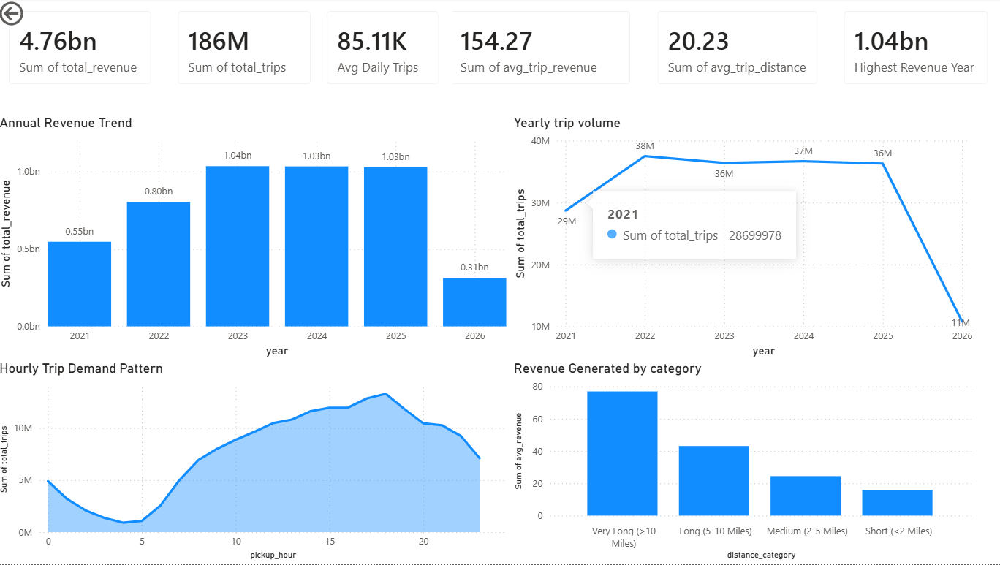

# Spark NYC Taxi Analytics Pipeline

A scalable big data analytics pipeline built using **Apache Spark** and **PySpark** to process, clean, analyze, and visualize over **213 million New York City Yellow Taxi trip records** spanning **2021 to 2026**.

---

## Project Overview

Urban transportation systems generate massive volumes of trip data every day. Extracting meaningful insights from such large-scale datasets requires distributed processing frameworks capable of handling high-throughput analytical workloads.

This project presents an end-to-end big data analytics pipeline developed using Apache Spark to process and analyze more than **213 million NYC Yellow Taxi trips** collected between January 2021 and April 2026.

The pipeline performs:

- Large-scale data ingestion from distributed Parquet datasets
- Schema harmonization across multi-year data partitions
- Data cleaning and validation
- Revenue and trend analysis
- Anomaly detection on transactional records
- Interactive business intelligence reporting through Power BI

The solution demonstrates how distributed data processing techniques can transform raw transportation data into actionable business insights.

---

## Dataset Information

| Attribute | Details |
|-----------|---------|
| Dataset | NYC Yellow Taxi Trip Records |
| Source | NYC Taxi and Limousine Commission (TLC) |
| Time Period | January 2021 - April 2026 |
| File Format | Parquet |
| Number of Files | 64 |
| Raw Records | 239+ Million |
| Cleaned Records | 213+ Million |
| Invalid Records Removed | 26+ Million |

---

## Key Features

### Distributed Data Processing

- Processed over **213 million records** using Apache Spark.
- Unified schemas across 64 heterogeneous Parquet datasets.
- Optimized Spark transformations for efficient large-scale analytics.

### Data Cleaning and Validation

Implemented data quality checks to remove:

- Null values
- Invalid passenger counts
- Corrupted timestamps
- Trips outside valid temporal boundaries
- Inconsistent and malformed records

The cleaning pipeline eliminated more than **26 million invalid records**.

### Revenue and Business Analytics

Generated insights related to:

- Total revenue generation
- Average fare amount
- Average tip amount
- Payment method distribution
- Passenger trends

### Temporal Trend Analysis

Performed analysis across:

- Yearly trends
- Monthly demand patterns
- Peak travel periods
- Seasonal variations

### Anomaly Detection

Identified and categorized suspicious transactions including:

- Extremely high fare amounts
- Abnormal trip distances
- Corrupted transactional records

Detected over **2.4 million anomalous records**.

---

## Business Insights

| Metric | Value |
|---------|-------|
| Total Revenue | \$4.78 Billion |
| Average Fare Amount | \$17.34 |
| Average Tip Amount | \$3.23 |
| Highest Recorded Trip Amount | \$863,380.37 |
| Total Valid Trips | 213+ Million |

### Key Findings

- Electronic payment methods dominate taxi transactions.
- Trip demand exhibits strong seasonal patterns.
- Revenue trends show consistent growth during the post-pandemic recovery period.
- A small proportion of transactions exhibit significant anomalies requiring further investigation.

---

## Technology Stack

- **Programming Language:** Python
- **Big Data Framework:** Apache Spark, PySpark
- **Query Engine:** Spark SQL
- **Storage Format:** Parquet
- **Data Visualization:** Power BI
- **Version Control:** Git, GitHub
- **Development Environment:** Jupyter Notebook, VS Code

---

## System Architecture

```text
NYC TLC Yellow Taxi Dataset
                │
                ▼
      Multi-Year Parquet Files
                │
                ▼
         Apache Spark Pipeline
                │
 ┌──────────────┼──────────────┐
 │              │              │
 ▼              ▼              ▼
Data        Data Quality   Schema
Ingestion   & Cleaning     Unification
                │
                ▼
        Feature Engineering
                │
                ▼
        Analytical Processing
                │
                ▼
         Anomaly Detection
                │
                ▼
          Curated Data Marts
                │
                ▼
        Power BI Dashboard
                │
                ▼
         Business Insights
```

---

## Project Structure

```text
spark-bigdata-transaction-pipeline/
│
├── data/
│   ├── raw/
│   └── processed/
│
├── notebooks/
│   ├── data_ingestion.ipynb
│   ├── data_cleaning.ipynb
│   ├── exploratory_analysis.ipynb
│   └── anomaly_detection.ipynb
│
├── scripts/
│   ├── load_data.py
│   ├── clean_data.py
│   ├── transform.py
│   └── anomaly_detection.py
│
├── dashboard/
│   └── NYC_Taxi_Dashboard.pbix
│
├── images/
│
├── requirements.txt
├── README.md
└── LICENSE
```

---

## Installation

### Clone the Repository

```bash
git clone https://github.com/Sumanth-Simha/spark-bigdata-transaction-pipeline.git

cd spark-bigdata-transaction-pipeline
```

### Create a Virtual Environment

```bash
python -m venv venv
```

### Activate the Environment

**Windows**

```bash
venv\Scripts\activate
```

**Linux/macOS**

```bash
source venv/bin/activate
```

### Install Dependencies

```bash
pip install -r requirements.txt
```

---

## Running the Pipeline

```bash
python scripts/load_data.py

python scripts/clean_data.py

python scripts/transform.py

python scripts/anomaly_detection.py
```

---

## Sample Spark Configuration

```python
SparkSession.builder \
    .appName("NYC Taxi Analytics Pipeline") \
    .config("spark.driver.memory", "4g") \
    .config("spark.executor.memory", "4g") \
    .config("spark.sql.shuffle.partitions", "8") \
    .getOrCreate()
```

---

## Dashboard

The project includes an interactive Power BI dashboard providing:

- Executive KPI overview
- Revenue analysis
- Passenger analysis
- Payment method analysis
- Time-series trend analysis
- Anomaly monitoring

Add dashboard screenshots inside the `images/` folder and include them as shown below:

```markdown

```

---

## Future Enhancements

- Real-time analytics using Apache Kafka
- Workflow orchestration using Apache Airflow
- Data warehousing using Apache Hive
- Predictive demand forecasting using Machine Learning
- Containerization using Docker
- Cloud deployment on AWS or Google Cloud Platform

---

## Author

**Sumanth Simha**

GitHub: https://github.com/Sumanth-Simha

---

## License

This project is licensed under the MIT License. See the `LICENSE` file for additional details.
